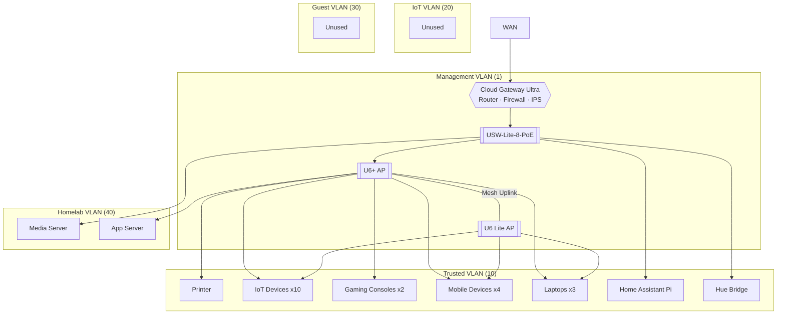

# homelab

## intro

this serves as a reference and inventory of my homelab setup - its current state and future work.

## purpose

this homelab grew out of my experience taking down my home network experimenting with pihole. i needed a way to segment my network and have a sandbox environment where misconfigurations were self-contained and other people and devices would not be affected. the verizon-supplied internet gateway did not support the functionality required to do this, so the network hardware migrated to a unifi stack. the homelab has since evolved as a way to learn about networking, self-host applications and services, repurpose old hardware, and explore networking, security, and infrastructure concepts without running up an aws bill.

## architecture

## network overview

### vlan scheme

- **management (1)** - network devices (i.e. gateway, switches, access points, etc.)
- **trusted (10)** - personal devices, consoles, and IoT (planned migration to IoT vlan) 
- **iot (20)** - provisioned, migration planned
- **guest (30)** - provisioned
- **homelab (40)** - servers, sandboxes

### segmentation

- vlans designed to be isolated from each other
- inter-vlan ALLOW from roku running media server client application (trusted) --> media server (homelab). allow established/related return traffic
- ipv6 not configured

## hardware

- **gateway** - UniFi Cloud Gateway Ultra
- **switch** - USW-Lite-8-PoE
- **access points** - U6+ & U6 Lite

