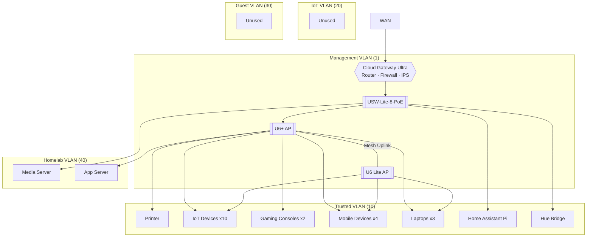

# homelab

## intro

this serves as a reference and inventory of my homelab setup - its current state and future work.

## purpose

this homelab grew out of my experience taking down my home network experimenting with pihole. i needed a way to segment my network and have a sandbox environment where misconfigurations were self-contained and other people and devices would not be affected. it has since evolved as a way to learn about networking, self-host applications and services, repurpose old hardware, and explore networking, security, and infrastructure concepts without running up an aws bill.

## architecture

## network overview

### vlan scheme

- **management (1)** - network devices (i.e. gateway, switches, access points, etc.)
- **trusted (10)** - personal devices, consoles, and IoT (planned migration to IoT vlan) 
- **iot (20)** - provisioned, migration planned
- **guest (30)** - provisioned, unused
- **homelab (40)** - servers, sandboxes

### segmentation

- vlans designed to be isolated from each other
- inter-vlan ALLOW from the network device list (tablet, roku stick, roku tv) which contains the devices running the jellyfin client application (trusted) --> media server (homelab). allow established/related return traffic
- ipv6 not configured

## hardware

- **gateway** - unifi cloud gateway ultra
- **switch** - usw-lite-8-poe
- **access points** - u6+ & u6 lite

## 24/7 servers

### raspberry pi 4
raspberry pi 4 running home assistant os. currently supporting lighting automation with phillips hue bulbs, hue motion sensor, an aqara presence sensor communicating over zigbee, and alexa speakers.

### 2017 macbook air
ubuntu server os. running jellyfin media server.

### 2018 macbook pro
ubuntu server os. running self-hosted apps/services: 
- todo list app (pwa, api, db)
- ntfy
- dockge
- news feed rss pwa

## remote access
tailscale is used to provide an encrypted tunnel to communicate with specific devices on the network securely. currently, there are no access control lists configured to prevent any devices on the tailnet from communicating with each other. the devices currently on my tailnet are:
- phone
- home assistant
- macbook air
- macbook pro
- daily laptop

using tailscale allows me to access home assistant from my phone and laptop while i am away securely. without access control lists, the devices running services are able to talk to my home assistant instance, which is not ideal and is referenced in the future work section.

## security
**ips** - block all tor/tor-associated traffic. in reviewing logs, i noticed a significant amount of traffic originating from tor-associated ip addresses to two devices on the homelab vlan. until i am able to identify and investigate further, i've configured the ips to block all tor traffic and traffic from tor-associated ip addresses.
**dhcp guarding** - dhcp guarding has been enabled on all vlans to prevent rogue or unauthorized dhcp servers on the network.

## roadmap
there's still much to be done to harden the network. this document will be updated as changes are made. future work is as follows:
- **tailscale access control lists** - not all devices on the tailnet need to be able to communicate with each other on all ports. access control lists need to be configured to enforce principle of least privilege
- **migrate iot devices to iot vlan (20)** - self explanatory. iot devices with weak or opaque security controls should live on their own vlan. access and functionality needs to be configured to balance security and functionality so features like airplay and communication with smart speakers are possible.
- **plan and configure guest network** - the guest network is currently unused. i need to figure out a method of adding an authentication/approval layer to the trusted vlan and a method for visitors to seamlessly log on to the wifi.
- **investigate tor traffic** - using ips to block tor traffic is a band aid fix for now. more investigation is needed to learn more
- **migrate jellyfin server** - to dedicated device and more appropriate vlan to avoid poking holes in what is intended to be a completely isolated vlan (40)
- **dedicated management vlan** - instead of using the default unifi vlan, move the management vlan and the unifi network devices to a dedicated vlan where i have full control over the configuration
- **migrate u6 lite from uplink to wired connection**
- **configure honeypot** - future project. i'm curious to explore what kinds of activity a honeypot would get
- **log forwarding to wazuh** - in the interest of building industry-relevant skills and increasing visibility into network activity
