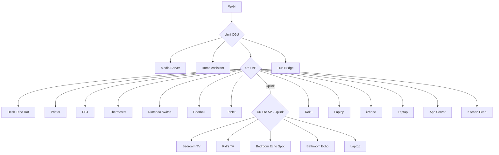

# homelab

## intro

this serves as a reference and inventory of my homelab setup - its current state and future work.

## purpose

this homelab from my experience taking down my home network experimenting with pihole. i needed a way to segment my network and have a sandbox environment where misconfigurations were self-contained and other people and devices would not be affected. the verizon-supplied internet gateway did not support the functionality required to do this, so the network hardware migrated to a unifi stack. the homelab has since evolved as a way to learn about networking, self-host applications and services, repurpose old hardware, and explore networking, security, and infrastructure concepts without running up an AWS bill.

## architecture

